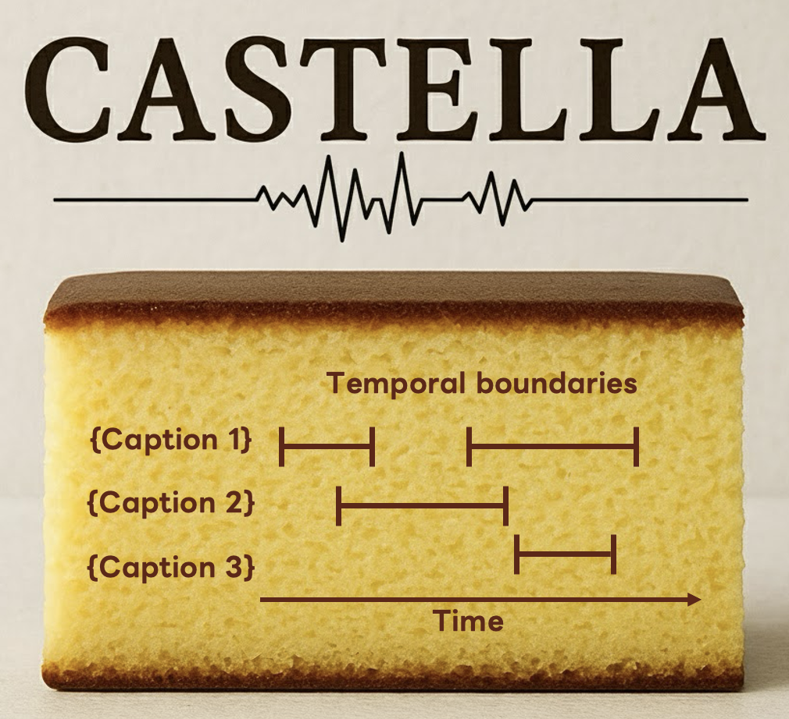

# CASTELLA: Long Audio Dataset with Captions and Temporal Boundaries
### TL;DR
This repository provides a new dataset that includes long audio, captions of local audio events, and temporal boundaries. Please also check [demo page](https://h-munakata.github.io/CASTELLA-demo/).



### Abstract of [paper](https://arxiv.org/abs/2511.15131)

We introduce CASTELLA, a human-annotated audio benchmark for the task of audio moment retrieval (AMR). Although AMR has various useful potential applications, there is still no established benchmark with real-world data. The early study of AMR trained the model with solely synthetic datasets. Moreover, the evaluation is based on annotated dataset of fewer than 100 samples. This resulted in less reliable reported performance. To ensure performance for applications in real-world environments, we present CASTELLA, a large-scale manually annotated AMR dataset. CASTELLA consists of 1,009, 213, and 640 audio recordings for train, valid, and test split, respectively, which is 24 times larger than the previous dataset. We also establish a baseline model for AMR using CASTELLA. Our experiments demonstrate that a model fine-tuned on CASTELLA after pre-training on the synthetic data outperformed a model trained solely on the synthetic data by 5.4 points in Recall1@0.7. CASTELLA is publicly available in https://h-munakata.github.io/CASTELLA-demo/.

## Annotation files
In the `json` folder, English and Japanese annotations are available.

The JSON file has a list of dictionaries containing the following:
- `global caption`
- `duration`
- `num_moments`
- `moments`
  - `local_caption`
  - `timestamps`

```json
[
  {
    "yid": "-0awng26xQ8",
    "global_caption": "A man is talking while driving, stops somewhere, then drives again",
    "duration": 299,
    "num_moments": 4,
    "moments": [
      {
        "local_caption": "A man is using the turn signal while talking",
        "timestamps": [
          [
            52,
            66
          ]
        ]
      },
      {
        "local_caption": "A man starts the car engine",
        "timestamps": [
          [
            70,
            76
          ]
        ]
      },
      {
        "local_caption": "A man switches on the turn signal and opens then shuts the car door",
        "timestamps": [
          [
            82,
            92
          ]
        ]
      },
      {
        "local_caption": "A man signals and drives",
        "timestamps": [
          [
            177,
            190
          ],
          [
            52,
            66
          ]
        ]
      }
    ]
  },
  ...
]
```

## Audio data
This repository does not contain the raw audio data.
The download script for the audio data is available on the [link](https://github.com/h-munakata/CASTELLA-audio).

## Statistics

| Split | # audio | # local captions | # timestamps |
|---------|--------|-----|------|
| Train | 1009 | 2208 | 6160 |
| Valid | 213 | 357 | 973 |
| Test | 640 | 1360 | 4175 |
| Total | 1862 | 3925 | 11308 |


## Audio moment retrieval
[Lighthouse](https://github.com/line/lighthouse/) supports the AMR recipe using CASTELLA for audio moment retrieval.
The extracted audio and text features of CASTELLA are available on [Zenodo](https://zenodo.org/records/17412176).

## Citation
```
@misc{munakata2025castella,
    authors={Hokuto Munakata, Takehiro Imamura, Taichi Nishimura, Tatsuya Komatsu},
    title={CASTELLA: Long Audio Dataset with Captions and Temporal Boundaries},
    journal={arXiv preprint arXiv:2511.15131},
    year={2025}
}
```
## License
[CC BY 4.0](https://creativecommons.org/licenses/by/4.0/)
